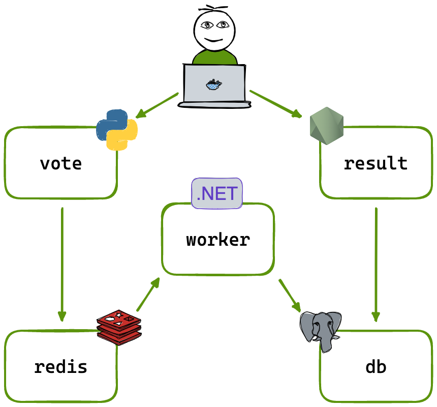

# Example Voting App

A simple distributed application running across multiple Docker containers.

## Getting started

Download [Docker Desktop](https://www.docker.com/products/docker-desktop) for Mac or Windows. [Docker Compose](https://docs.docker.com/compose) will be automatically installed. On Linux, make sure you have the latest version of [Compose](https://docs.docker.com/compose/install/).

This solution uses Python, Node.js, .NET, with Redis for messaging and Postgres for storage.

Run in this directory to build and run the app:

```shell
docker compose up
```

The `vote` app will be running at [http://localhost:8080](http://localhost:8080), and the `result` app will be at [http://localhost:8081](http://localhost:8081).

Alternately, if you want to run it on a [Docker Swarm](https://docs.docker.com/engine/swarm/), first make sure you have a swarm. If you don't, run:

```shell
docker swarm init
```

Once you have your swarm, in this directory run:

```shell
docker stack deploy --compose-file docker-stack.yml vote
```

## Run the app in Kubernetes

The `k8s-specifications` folder contains the YAML specifications for the Voting App services.

Run the following command to create the deployments and services. Note it will create these resources in your current namespace (`default` if you haven't changed it.)

```shell
kubectl create -f k8s-specifications/
```

The `vote` web app is then available on port 31000 on each host of the cluster, the `result` web app is available on port 31001.

To remove them, run:

```shell
kubectl delete -f k8s-specifications/
```

## Architecture



* A front-end web app in [Python](vote/) which lets you vote between two options
* A [Redis](https://hub.docker.com/_/redis/) which collects new votes
* A [.NET](worker/) worker which consumes votes and stores them in…
* A [Postgres](https://hub.docker.com/_/postgres/) database backed by a Docker volume
* A [Node.js](result/) web app which shows the results of the voting in real time

## Notes

The voting application only accepts one vote per client browser. It does not register additional votes if a vote has already been submitted from a client.

This isn't an example of a properly architected perfectly designed distributed app... it's just a simple
example of the various types of pieces and languages you might see (queues, persistent data, etc), and how to
deal with them in Docker at a basic level.

## Azure DevOps and AKS Deployment

This workflow builds and publishes each microservice image with Azure DevOps, then deploys the application to AKS through Argo CD.

### 1. Prepare Azure DevOps and Azure Container Registry

1. Create a project in Azure DevOps.
2. Import this repository from Git.
3. Set the `main` branch as the default branch.
4. Create an Azure Container Registry (ACR).

### 2. Create the microservice pipelines

Create one pipeline for each microservice.

1. Go to **Pipelines** in Azure DevOps.
2. Select **Azure Repos Git**.
3. Select the repository.
4. Provide the image name.
5. Update each pipeline YAML file so its trigger is limited to the relevant microservice path.
6. Update pipeline variables as needed.

### 3. Configure a self-hosted agent

1. Create a self-hosted agent.
2. Set up and configure the agent by using the `config.sh` script.
3. Install Docker and configure the required permissions:

   ```shell
   sudo apt-get update
   sudo apt-get install docker.io
   sudo usermod -aG docker azureuser
   sudo chmod 660 /var/run/docker.sock
   ```

4. Run `run.sh`.
5. Manually verify that the pipeline runs on the self-hosted agent and pushes the image to the container registry.
6. Make a change within a microservice directory to verify that the relevant pipeline triggers automatically.

### 4. Connect to AKS

1. Launch the AKS cluster.
2. Sign in to Azure and connect to the cluster:

   ```shell
   az login
   az aks get-credentials --resource-group <RESOURCE_GROUP> --name <AKS_CLUSTER_NAME> --overwrite-existing
   ```

### 5. Install and access Argo CD

1. Install and configure Argo CD in the cluster.
2. Verify that the Argo CD services are running and identify the node details:

   ```shell
   kubectl get svc -n argocd
   kubectl get node -o wide
   ```

3. Copy the external IP address and NodePort.
4. Allow the NodePort in the Network Security Group (NSG) for the agent pool VM scale set.
5. Access Argo CD by using the external IP address and NodePort, then sign in.

### 6. Configure Argo CD

1. Add the repository to Argo CD:
   * Connect the repository over HTTP or HTTPS.
   * Copy the repository URL and insert the PAT token before `@dev.azure.com`:

     ```text
     https://<PAT>@dev.azure.com/kailash9696/voting-app/_git/voting-app
     ```

2. Create an Argo CD application that connects to the Kubernetes cluster:
   * Provide the project name.
   * Provide the repository URL.
   * Provide the path to the manifest files.
   * Verify that Argo CD detects the changes.

### 7. Update deployment manifests from the pipeline

1. Create a script that updates the deployment manifest image to the latest tag for every pipeline run.
2. Add an update stage to each pipeline.
3. Execute the pipeline.
4. Verify that the script updates the images in the Kubernetes deployment manifests.

### 8. Resolve private-registry image pulls

If you see `ErrImagePull` because a private repository is being used:

1. In ACR, go to **Access keys** and enable the admin user.
2. Create a secret using the credentials.
3. Update the deployment YAML to include an `imagePullSecrets` section.
4. Execute the pipeline again.

### 9. Access the application

1. Allow the microservice ports in the agent pool VM scale set.
2. Access the application.
